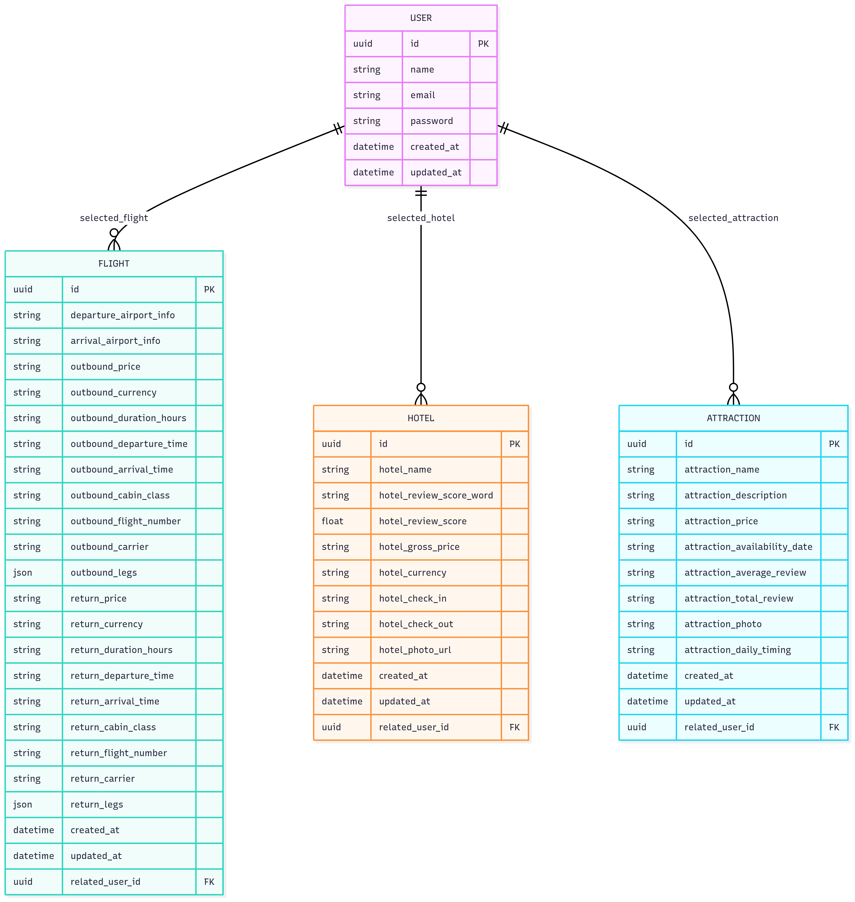

# 🌱 Trip Planner Backend

This is the **backend** of the **Trip Planner** project.  
It provides the API endpoints for **user authentication, profile management, hotels, flights, and attractions** to support the frontend application.

🚀 Frontend Live Demo: [https://viajero-bh.surge.sh](https://viajero-bh.surge.sh)

---

## 🔗 Frontend Repository

The frontend of this project is available here:  
[Trip Planner Frontend](https://github.com/sahmedjaffer/Farm_Project_FrontEnd.git)

---

## 🛠️ Tech Stack

- **Language**: Python  
- **Framework**: FastAPI  
- **Database**: PostgreSQL (hosted on [neon.tech](https://neon.tech))  
- **Caching**: Redis Cloud  
- **External APIs**: RapidAPI for flights, hotels, or attractions data  
- **ORM**: Tortoise ORM  
- **Serialization**: Pydantic (via `pydantic_model_creator`)  
- **API Documentation**: Swagger UI (auto-generated by FastAPI)  

---

## 📁 Project Structure

```plaintext
trip_planner_backend/
├── config/              
├── migrations/          
├── models/              
├── services/            
├── main.py              
├── requirements.txt     
├── Pipfile              
├── Pipfile.lock         
└── tortoise_config.py   
```

---

## 🗂️ Database Models, Relationships & Pydantic Serialization

All relationships are **One-to-Many**:  
- One **User** → Many **Hotels, Flights, Attractions, and History records**.

### Models and Serialization:

#### User
- **Fields:** `id (UUID)`, `first_name`, `last_name`, `email`, `password`, `created_at`, `updated_at`  
- **Relations:**  
  - One-to-Many with `Hotel` (`selected_hotel`)  
  - One-to-Many with `Flight` (`selected_flight`)  
  - One-to-Many with `Attraction` (`selected_attraction`)  
- **Pydantic:**  
```python
user_pydantic = pydantic_model_creator(User, name="User")
user_pydanticIn = pydantic_model_creator(User, name="UserIn", exclude_readonly=True)
```

#### Flight
- **Fields:** departure/arrival info, outbound/return pricing, duration, times, cabin class, flight numbers, carrier, legs (JSON), timestamps  
- **Relations:**  
  - Belongs to `User` (`related_user`)  
- **Pydantic:**  
```python
flight_pydantic = pydantic_model_creator(Flight, name="Flight")
flight_pydanticIn = pydantic_model_creator(Flight, name="FlightIn", exclude_readonly=True)
```

#### Hotel
- **Fields:** name, review score, gross price, currency, check-in/out, photo URL, timestamps  
- **Relations:**  
  - Belongs to `User` (`related_user`)  
- **Pydantic:**  
```python
hotel_pydantic = pydantic_model_creator(Hotel, name="Hotel")
hotel_pydanticIn = pydantic_model_creator(Hotel, name="HotelIn", exclude_readonly=True)
```

#### Attraction
- **Fields:** name, description, price, availability, review info, photo, daily timing, timestamps  
- **Relations:**  
  - Belongs to `User` (`related_user`)  
- **Pydantic:**  
```python
attraction_pydantic = pydantic_model_creator(Attraction, name="Attraction")
attraction_pydanticIn = pydantic_model_creator(Attraction, name="AttractionIn", exclude_readonly=True)
```

#### History
- **Fields:** id, user_id, action, timestamp  
- **Relations:**  
  - Belongs to `User`  

---

## 🖼️ ERD (Entity Relationship Diagram)

You can place your ERD diagram here:  

  

---

## 🚀 Deployment

The backend is deployed on **Render.com**:  
[https://farm-project-backend.onrender.com](https://farm-project-backend.onrender.com)

---

## 🧪 API Documentation (Swagger UI)

You can access the live Swagger UI here:  
[https://farm-project-backend.onrender.com/docs#/](https://farm-project-backend.onrender.com/docs#/)

---

## 👤 Author

Developed by **[Your Name]** ✨  
Supports the **Trip Planner Frontend**.
